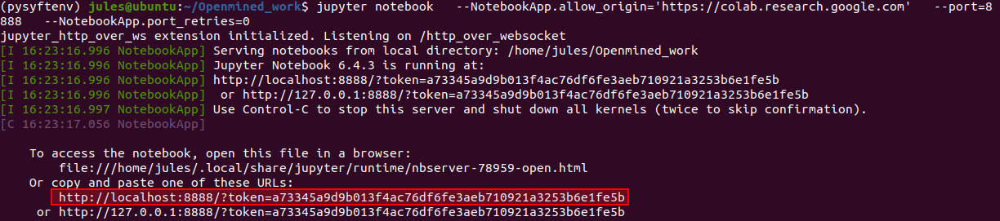
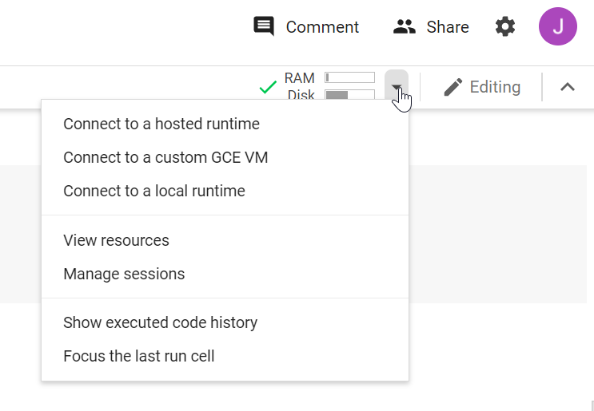

# Federated_Learning_Workshop
Content for the Tutorial: Practical Introduction to Federated Learning given on Oct. 29, 2021. 
See https://digicosme.cnrs.fr/ecole-thematique-2021-graph-as-models-in-life-sciences-machine-learning-and-integrative-approaches/

# Getting the notebooks and data

The **PIMA dataset** is available on Kaggle at the following address:

https://www.kaggle.com/uciml/pima-indians-diabetes-database

If you are registered in the workshop mailing list, you also received a copy by email.

The three notebooks we will be working on are :
* Data scientist notebook : https://colab.research.google.com/drive/1X_5izIrmllnDcVak0Dlw3tgzOFhbL--N?usp=sharing

* Data Owner 1 notebook:
https://colab.research.google.com/drive/1XCGLaohKql024ibkbShX8NEPmPQz2TKW?usp=sharing

* Data Owner 2 notebook:
https://colab.research.google.com/drive/1WLgy0U4HvQnS7-9_oLnCwE_e2295LtzS?usp=sharing

# Connecting the notebooks to a local environment
Google Colab works by attributing resources on Google servers. They tend to be unreliable and disconnect, which will impact negatively your experience in this training, especially because it is sometimes necessary to reinstall all dependencies and start again from scratch. We recommend doing the local environment setup if you are able to.

## If you do not wish to connect the notebooks to a local environment:
You can stop reading this resource.

## If you are already familiar with Jupyter, conda/pip (or brave enough to try installing it):

Follow these instructions that will help you getting a Jupyter server online :
https://research.google.com/colaboratory/local-runtimes.html

Alternatively, you can of course download the .ipynb files (*File>Download*) and simply run them in the Jupyter editor instead of Colab.

As described in the instructions linked above, you should have a running Jupyter console providing access links (see at the bottom of the image):

Copy the link containing *localhost* to your clipboard.
Go to the Google Colab tab in your browser and at the top right, open the environment menu by clicking on the small arrow as shown below. Then select **Connect to a local runtime**.

Paste the link in the window that appeared and click **Connect**.

Do this for all Colab notebooks.

# Upload the data

In both **Data Owner** notebooks, upload the dataset *diabetes.csv* by clicking the folder icon on the left sidebar, then clicking the **Upoad** button (see image).

# First steps 

Run the first cell, installing the packages. 
* If you are connected to a local environment (see [the previous section](#connecting-the-notebooks-to-a-local-environment)), install the packages in one Colab only is enough -- as they are all sharing the same environment.
* Else, run the first cell independently in all Colabs. It will take a few minutes to install, so do it in parallel.

In the second cell (starting Duet), if you are running a local environment you can add *loopback=true* as written in the cell comments. 